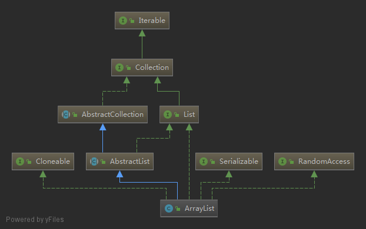

# ArrayList
> 可调整大小的数组的实现List接口。实现所有可选列表操作，并允许所有元素，包括null 。

### 继承体系

- ArrayList实现了List接口,具有基本的增删改查功能  
- ArrayList实现了Cloneable接口,具有被克隆功能  
- ArrayList实现了Serializable接口,具有实例化功能
- ArrayList实现了RandomAccess接口,具有随机访问的功能

### 详细解析
#### 属性
```java
    // 默认容量
    private static final int DEFAULT_CAPACITY = 10;
    // 空数组
    private static final Object[] EMPTY_ELEMENTDATA = {};
    // 空数组
    private static final Object[] DEFAULTCAPACITY_EMPTY_ELEMENTDATA = {};
    // 元素数组,此处用transient修饰,意在序列化时不会序列化整个数组,而是序列化元素
    transient Object[] elementData;
    // 容器中的元素数量,非容器数组长度
    private int size;
    // 最大数组长度
    private static final int MAX_ARRAY_SIZE = Integer.MAX_VALUE - 8;
```
<span id='p1'/>PS:  
[关于`EMPTY_ELEMENTDATA`和`DEFAULTCAPACITY_EMPTY_ELEMENTDATA`分析](#k1)  
[关于`transient`修饰`elementData`分析](#k2)

#### 构造方法

1. ArrayList(int initialCapacity)  
传入初始容量构造指定容量的ArrayList
```java
    public ArrayList(int initialCapacity) {
        // 初始容量大于0则构造指定长度数组
        if (initialCapacity > 0) {
            this.elementData = new Object[initialCapacity];
        } else if (initialCapacity == 0) {
            // 等于0就初始化一个空数组
            this.elementData = EMPTY_ELEMENTDATA;
        } else {
            // 小于0抛出IllegalArgumentException
            throw new IllegalArgumentException("Illegal Capacity: "+ initialCapacity);
        }
    }
```
2. ArrayList()  
初始化一个空数组,后续扩容时会初始化为默认容量
```java
    public ArrayList() {
        this.elementData = DEFAULTCAPACITY_EMPTY_ELEMENTDATA;
    }
```
3. ArrayList(Collection<? extends E> c)  
创建一个包含指定集合元素的列表
```java
    public ArrayList(Collection<? extends E> c) {
            // 集合转数组
            elementData = c.toArray();
            if ((size = elementData.length) != 0) {
                // c.toArray可能不会返回Object[],因为toArray()可能被重写
                if (elementData.getClass() != Object[].class)
                    // 处理返回一个Object[]
                    elementData = Arrays.copyOf(elementData, size, Object[].class);
            } else {
                // 用空数组替换
                this.elementData = EMPTY_ELEMENTDATA;
            }
        }
```

#### 新增

1. `add(E e)`  
向数组尾部增加一个元素,成功返回true
```java
    public boolean add(E e) {
            // 检查容量以及扩容
            ensureCapacityInternal(size + 1);
            // 添加元素
            elementData[size++] = e;
            return true;
        }
```

2. `add(int index, E element)`  
在指定索引处增加元素
```java
    public void add(int index, E element) {
        // 检查索引
        rangeCheckForAdd(index);
        // 检查容量以及扩容
        ensureCapacityInternal(size + 1);
        // 将index后的元素整体朝后移一位
        System.arraycopy(elementData, index, elementData, index + 1,size - index);
        // 在index处插入元素
        elementData[index] = element;
        size++;
    }
    // -------------检查索引,抛出IndexOutOfBoundsException
    private void rangeCheckForAdd(int index) {
        if (index > size || index < 0)
            throw new IndexOutOfBoundsException(outOfBoundsMsg(index));
    }
```

3. `addAll(Collection<? extends E> c)`  
添加指定集合的元素到列表,添加元素不为0,返回true
```java
    public boolean addAll(Collection<? extends E> c) {
        // 集合转数组
        Object[] a = c.toArray();
        int numNew = a.length;
        // 检查扩容
        ensureCapacityInternal(size + numNew);  // Increments modCount
        // 将元素复制到数组
        System.arraycopy(a, 0, elementData, size, numNew);
        // 更新元素数
        size += numNew;
        // 添加元素不为0,返回true
        return numNew != 0;
    }
```
4. `addAll(int index, Collection<? extends E> c)`  
添加指定集合的元素到列表指定索引位置,添加元素不为0返回true
```java
    public boolean addAll(int index, Collection<? extends E> c) {
        // 检查索引
        rangeCheckForAdd(index);
        // 集合转数组
        Object[] a = c.toArray();
        int numNew = a.length;
        // 检查扩容
        ensureCapacityInternal(size + numNew);
        // index之后的元素移动的位置
        int numMoved = size - index;
        // index之后的元素移动
        if (numMoved > 0)
            System.arraycopy(elementData, index, elementData, index + numNew,
                            numMoved);
        // 将集合数组插入index位置之后
        System.arraycopy(a, 0, elementData, index, numNew);
        // 更新元素数量
        size += numNew;
        // 添加元素不为0返回true
        return numNew != 0;
    }
```

**扩容原理**
```java
    // ------------扩容
    private void ensureCapacityInternal(int minCapacity) {
        ensureExplicitCapacity(calculateCapacity(elementData, minCapacity));
    }
    // ------------计算最小容量
    private static int calculateCapacity(Object[] elementData, int minCapacity) {
        // 如果元素数组为空数组,则返回默认容量值(10)与指定容量之间最大值
        if (elementData == DEFAULTCAPACITY_EMPTY_ELEMENTDATA) {
            return Math.max(DEFAULT_CAPACITY, minCapacity);
        }
        return minCapacity;
    }
    // ------------扩容
    private void ensureExplicitCapacity(int minCapacity) {
        // 操作值+1
        modCount++;

        // 如果指定容量比现有容量大则扩容
        if (minCapacity - elementData.length > 0)
            grow(minCapacity);
    }
    // ------------扩容
    private void grow(int minCapacity) {
        // 新容量为旧容量1.5倍
        int oldCapacity = elementData.length;
        int newCapacity = oldCapacity + (oldCapacity >> 1);
        // 如果新容量小于旧容量就缩减容量
        if (newCapacity - minCapacity < 0)
            newCapacity = minCapacity;
        // 如果新容量大于最大数组长度,就是用最大值
        if (newCapacity - MAX_ARRAY_SIZE > 0)
            newCapacity = hugeCapacity(minCapacity);
        // 复制新数组
        elementData = Arrays.copyOf(elementData, newCapacity);
    }
    // ------------计算最大值返回
    private static int hugeCapacity(int minCapacity) {
        if (minCapacity < 0) // overflow
            throw new OutOfMemoryError();
        return (minCapacity > MAX_ARRAY_SIZE) ?
            Integer.MAX_VALUE :
            MAX_ARRAY_SIZE;
    }
```

#### 查询

1. `get(int index)`  
获取指定索引元素
```java
    public E get(int index) {
        // 检查元素
        rangeCheck(index);
        // 返回数组位置元素
        return elementData(index);
    }
```
2. `indexOf(Object o)`  
获取指定元素的索引,不存在返回-1
```java 
    public int indexOf(Object o) {
        // 此处对于null使用==判断,而对于对象使用equal判断
        if (o == null) {
            for (int i = 0; i < size; i++)
                if (elementData[i]==null)
                    return i;
        } else {
            for (int i = 0; i < size; i++)
                if (o.equals(elementData[i]))
                    return i;
        }
        return -1;
    }
```
3. `isEmpty()`  
判断列表是否为空,元素个数为0返回true
```java
    public boolean isEmpty() {
        return size == 0;
    }
```
4. `contains(Object o)`  
判断列表中是否存在元素,若存在索引则返回true
```java
    public boolean contains(Object o) {
        return indexOf(o) >= 0;
    }
```
#### 修改

1. `set(int index, E element)`  
将指定索引位置修改为指定元素,返回旧元素
```java
    public E set(int index, E element) {
        // 检查索引
        rangeCheck(index);
        // 获取旧元素用于返回
        E oldValue = elementData(index);
        // 插入元素
        elementData[index] = element;
        // 返回旧元素
        return oldValue;
    }
```

2. `replaceAll(UnaryOperator<E> operator)`  
将列表的每个元素进行operator操作
```java
    public void replaceAll(UnaryOperator<E> operator) {
        // 检查null
        Objects.requireNonNull(operator);
        // 获取操作数和元素数
        final int expectedModCount = modCount;
        final int size = this.size;
        // 遍历进行operator的apply操作
        for (int i=0; modCount == expectedModCount && i < size; i++) {
            elementData[i] = operator.apply((E) elementData[i]);
        }
        // fail-fast
        if (modCount != expectedModCount) {
            throw new ConcurrentModificationException();
        }
        modCount++;
    }
```

#### 删除

1. `remove(int index)`  
删除指定位置元素,返回被删除的元素
```java
    public E remove(int index) {
        // 检查索引
        rangeCheck(index);
        // 操作值+1
        modCount++;
        // 获取旧值
        E oldValue = elementData(index);
        // index后应该移动的元素
        int numMoved = size - index - 1;
        // index后的元素向前移动一位
        if (numMoved > 0)
            System.arraycopy(elementData, index+1, elementData, index, numMoved);
        // 将最后一位置为null
        elementData[--size] = null; // clear to let GC do its work
        // 返回旧元素
        return oldValue;
    }
```

2. `remove(Object o)`  
删除指定元素,删除成功返回true,由于列表可以存储相同的值,所以删除索引顺序第一个相同的值
```java
    public boolean remove(Object o) {
        // null用==比较,object用equals()比较
        if (o == null) {
            for (int index = 0; index < size; index++)
                if (elementData[index] == null) {
                    fastRemove(index);
                    return true;
                }
        } else {
            for (int index = 0; index < size; index++)
                if (o.equals(elementData[index])) {
                    fastRemove(index);
                    return true;
                }
        }
        return false;
    }
```

3. `removeAll(Collocation<?> c)`  
删除指定集合包含的所有元素
```java
    public boolean removeAll(Collection<?> c) {
        // 判断集合是否为null,为null抛出NPE
        Objects.requireNonNull(c);
        return batchRemove(c, false);
    }
    //----------- 批量删除
    private boolean batchRemove(Collection<?> c, boolean complement) {
        final Object[] elementData = this.elementData;
        int r = 0, w = 0;
        boolean modified = false;
        try {
            // 遍历集合
            for (; r < size; r++)
                // c中是否包含该元素,包含(或不包含)将元素数组的由0开始的位置开始填充
                if (c.contains(elementData[r]) == complement)
                    elementData[w++] = elementData[r];
        } finally {
            // 原注解:为了保存AbstractCollection的行为模式,即使c.contains()抛出异常也要处理
            if (r != size) {
                System.arraycopy(elementData, r,
                                 elementData, w,
                                 size - r);
                w += size - r;
            }
            // 如果删除元素不为0
            if (w != size) {
                // 将w位置之后的元素置为null
                for (int i = w; i < size; i++)
                    elementData[i] = null;
                // 增加操作数
                modCount += size - w;
                // 更新元素数
                size = w;
                // 返回true
                modified = true;
            }
        }
        return modified;
    }
```

4. `retainAll(Collection<?> c)` 
  删除指定集合不包含的元素
```java
    public boolean retainAll(Collection<?> c) {
        // 判断null
        Objects.requireNonNull(c);
        // 批量删除
        return batchRemove(c, true);
    }
```

5. `removeIf(Predicate<? super E> filter)`
在指定过滤函数操作之后删除
```java
    public boolean removeIf(Predicate<? super E> filter) {
        // 判断filter不为null
        Objects.requireNonNull(filter);
        // 删除总数
        int removeCount = 0;
        // 装filter过滤后的元素的容器
        final BitSet removeSet = new BitSet(size);
        // 理想操作数,在遍历时使用,保证线程安全,基于Fail-fast机制
        final int expectedModCount = modCount;
        final int size = this.size;
        // 遍历元素,执行filter的过滤方法,通过则将元素放进容器,移除元素数+1
        for (int i=0; modCount == expectedModCount && i < size; i++) {
            @SuppressWarnings("unchecked")
            final E element = (E) elementData[i];
            if (filter.test(element)) {
                removeSet.set(i);
                removeCount++;
            }
        }
        // 如果操作数不一致表示此时线程不安全,此时抛出ConcurrentModificationException执行快速失败
        if (modCount != expectedModCount) {
            throw new ConcurrentModificationException();
        }

        final boolean anyToRemove = removeCount > 0;
        if (anyToRemove) {
            final int newSize = size - removeCount;
            // 使用bitSet过滤剩余的元素,并将其放在依次方法数组前
            for (int i=0, j=0; (i < size) && (j < newSize); i++, j++) {
                i = removeSet.nextClearBit(i);
                elementData[j] = elementData[i];
            }
            // 将数组尾部填充null
            for (int k=newSize; k < size; k++) {
                elementData[k] = null;  // Let gc do its work
            }
            // 更新元素数
            this.size = newSize;
            // fail-fast
            if (modCount != expectedModCount) {
                throw new ConcurrentModificationException();
            }
            modCount++;
        }

        return anyToRemove;
    }
```

#### EXTRA
- <span id="k1"/>*关于`DEFAULTCAPACITY_EMPTY_ELEMENTDATA`和`EMPTY_ELEMENTDATA`*[出处](#p1)   
  两个值都是定义的空数组  
  `DEFAULTCAPACITY_EMPTY_ELEMENTDATA`用于无参构造函数初始化数组,后扩容默认最小为`DEFAULT_CAPACITY`即为10  
  `EMPTY_ELEMENTDATA`用于有参构造时参数数组长度为0时初始化数组,此时默认最小大小为输入值
- <span id="k2"/>*使用`transient`修饰`elementData`*[出处](#p1)  
  `transient`修饰的参数不会被序列化  
  在ArrayList中数组`elementData`的长度 >= 真实元素数`size`,故在序列化的时候不需要将整个数组序列化,而是将存储的元素序列化即可  
- *自定义序列化和反序列化*  
  JVM在序列化/反序列化时会调用对象的对应方法,重写`readObject()`和`writeObject()`实现自定义  
```java
    // 序列化
    private void writeObject(ObjectOutputStream s)
        int expectedModCount = modCount;
        s.defaultWriteObject();
        // 写入元素数
        s.writeInt(size);
        // 将元素写入流
        for (int i=0; i<size; i++) {
            s.writeObject(elementData[i]);
        }
        // fail-fast
        if (modCount != expectedModCount) {
            throw new ConcurrentModificationException();
        }
    }
    // 反序列化
    private void readObject(ObjectInputStream s){
        elementData = EMPTY_ELEMENTDATA;
        s.defaultReadObject();

        s.readInt(); 

        if (size > 0) {
            // 检查容量以及检查流
            int capacity = calculateCapacity(elementData, size);
            SharedSecrets.getJavaOISAccess().checkArray(s, Object[].class, capacity);
            // 扩容以及赋予新数组
            ensureCapacityInternal(size);

            Object[] a = elementData;
            // 将流中元素填充进数组
            for (int i=0; i<size; i++) {
                a[i] = s.readObject();
            }
        }
    }
```
- *FAIL-FAST:快速失败机制*  
ArrayList的操作环境是不安全的,当多线程操作ArrayList时不能保证线程安全,故当一个线程在修改/删除元素操作时如果被其他线程对数据结构干扰,此时不能保证数据安全性,所以抛出`ConcurrentModificationException`  
核心原理:在执行操作时记录旧值expectedModCount,如果在执行更新数据操作时modCount的值不与旧值一致就证明其他线程执行了更新操作故抛出异常终止操作
```java
    final int expectedModCount = modCount;
    if (modCount != expectedModCount) {
        throw new ConcurrentModificationException();
    }
```