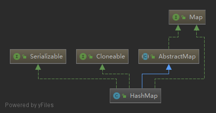

# HashMap
> 基于哈希表的实现的Map接口。 此实现提供了所有可选的map操作，并允许null的值和null键。

### 继承体系

- 实现Serializable接口,可序列化
- 实现Clone接口,可克隆
- 实现Map接口,具有基本Map的crud操作

### 详细属性

#### 属性
```java
    // ----------------------常量
    // 初始化默认容量16
    static final int DEFAULT_INITIAL_CAPACITY = 1 << 4;
    // 最大容量
    static final int MAXIMUM_CAPACITY = 1 << 30;
    // 默认负载因子
    static final float DEFAULT_LOAD_FACTOR = 0.75f;
    // 树化阈值
    static final int TREEIFY_THRESHOLD = 8;
    // 拆分树化阈值
    static final int UNTREEIFY_THRESHOLD = 6;
    // 最小树容量
    static final int MIN_TREEIFY_CAPACITY = 64;
    // ----------------------属性
    // 桶
    transient Node<K,V>[] table;
    // 保持缓存的集合
    transient Set<Map.Entry<K,V>> entrySet;
    // 桶中包含的键值对映射数
    transient int size;
    // 操作数,用于fail-fast机制
    transient int modCount;
    // 扩容/缩减的阈值 = 容量 * 负载因子
    int threshold;
    // 负载因子
    final float loadFactor;
    // Node结构
    static class Node<K,V> implements Map.Entry<K,V> {
        final int hash;
        final K key;
        V value;
        Node<K,V> next;
    }
```

#### 构造方法

1. HashMap()
设置负载因子为默认负载因子
```java
    public HashMap() {
        this.loadFactor = DEFAULT_LOAD_FACTOR;
    }
```

2. HashMap(int initialCapacity)  
传入默认容量,负载因子使用默认负载因子
```java
    public HashMap(int initialCapacity) {
        this(initialCapacity, DEFAULT_LOAD_FACTOR);
    }
```

3. HashMap(int initialCapacity, float loadFactor)
传入默认容量和负载因子
```java
    public HashMap(int initialCapacity, float loadFactor) {
        // 检查值
        if (initialCapacity < 0)
            throw new IllegalArgumentException("Illegal initial capacity: " +
                                               initialCapacity);
        if (initialCapacity > MAXIMUM_CAPACITY)
            initialCapacity = MAXIMUM_CAPACITY;
        if (loadFactor <= 0 || Float.isNaN(loadFactor))
            throw new IllegalArgumentException("Illegal load factor: " + loadFactor);
        // 赋值和计算与传入默认容量最接近的二进制数
        this.loadFactor = loadFactor;
        this.threshold = tableSizeFor(initialCapacity);
    }
    // 计算最接近的二进制数,例如cap = 5
    static final int tableSizeFor(int cap) {
        int n = cap - 1;  // n = 4: 0000 0000 0000 0100 
        n |= n >>> 1;     // n = 6: 0000 0000 0000 0110
        n |= n >>> 2;     // n = 7: 0000 0000 0000 0111
        n |= n >>> 4;     // n = 7: 0000 0000 0000 0111
        n |= n >>> 8;     // n = 7: 0000 0000 0000 0111
        n |= n >>> 16;    // n = 7: 0000 0000 0000 0111
        return (n < 0) ? 1 : (n >= MAXIMUM_CAPACITY) ? MAXIMUM_CAPACITY : n + 1;
    }
```

4. 
```java
    public HashMap(Map<? extends K, ? extends V> m) {
        this.loadFactor = DEFAULT_LOAD_FACTOR;
        putMapEntries(m, false);
    }
```